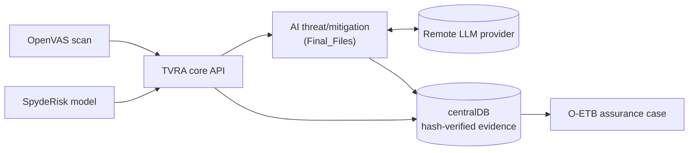

# TVRA Toolkit

[](https://github.com/mahend72/TVRA/actions/workflows/ci.yml)
[](https://github.com/mahend72/TVRA/actions/workflows/build.yml)
[](https://github.com/mahend72/TVRA/actions/workflows/release.yml)

Threat, Vulnerability and Risk Assessment tooling for IoMT and other
cyber-physical systems, developed within the MedSecurance project (https://www.medsecurance.org/).

## Overview

This repository brings together four independently-deployed services around
a shared evidence store:

1. **TVRA core API** (`deployment/src/medsec`) — vulnerability scanning via
   OpenVAS, and threat/risk modelling via the SpydeRisk System Modeller.
2. **Evidence Manager / centralDB** (`centralDB`) — versioned, SHA-256-hashed
   storage for scan reports, threat models, and mitigation output.
3. **AI-assisted threat modelling and mitigation** (`Final_Files`) — two
   FastAPI services that call a remote LLM (OpenAI, Anthropic, Azure OpenAI,
   Groq, Together AI, or a remote Ollama instance) to extend a threat list
   and draft per-threat mitigation text.
4. **Assurance / O-ETB integration** (`Assurance/build`) — a working example
   of gating an assurance-case claim on evidence recorded in centralDB, built
   against the (externally maintained, not included here) O-ETB engine.

See [docs/ARCHITECTURE.md](docs/ARCHITECTURE.md) for how these communicate,
including a data-flow diagram.

## Motivation and research problem

Producing a defensible risk assessment for a connected medical device or
similar cyber-physical system means combining several kinds of evidence —
automated vulnerability scan results, a structured threat/risk model, and
mitigation guidance — and being able to show *why* a given risk claim is
considered addressed. This toolkit's problem statement is narrower than "AI
security" in general: it is about (a) automating the mechanical parts of
that pipeline (scanning, risk calculation, first-pass threat/mitigation
drafting), and (b) keeping every output traceable to recorded, hash-verified
evidence, so a human reviewer has something concrete to check rather than an
unverifiable narrative.

## Key contributions

- A working OpenVAS → SpydeRisk → evidence-store pipeline with SHA-256
  integrity verification on every stored artefact.
- A provider-agnostic client for LLM-assisted threat/mitigation drafting
  (`Final_Files/remote_ai_client.py`), decoupled from any single vendor.
- A demonstrated pattern for gating an assurance-case claim on recorded
  evidence (`Assurance/build/files/KB/`), rather than an unchecked assertion.
- A TVRA-model-to-SpydeRisk import path (`deployment/src/medsec/tvra_parser.py`)
  that reconstructs assets, relationships, misbehaviours and controls from a
  UML/TVRA JSON export.

## AI Assurance perspective

Only the `Final_Files` services and one vision call in the TVRA core API
(`api.get_plot_threat_model`) call a machine-learning model; everything else
is deterministic tooling. [docs/AI_ASSURANCE.md](docs/AI_ASSURANCE.md) walks
through reliability, groundedness, robustness, security, traceability,
uncertainty, reproducibility, human oversight, and accountability for that
AI-assisted surface specifically, with evidence drawn from the code and
tests — not generic AI-assurance theory. The short version: LLM-generated
threat/mitigation text should be treated as **unverified analyst input
requiring human review**, not as a validated security control.

## Architecture overview



Full diagram and per-component detail: [docs/ARCHITECTURE.md](docs/ARCHITECTURE.md).

## Repository structure

```text
.
├── deployment/
│   ├── src/medsec/      # TVRA core FastAPI service (OpenVAS + SpydeRisk)
│   ├── spyderisk/       # SpydeRisk/Keycloak/nginx provisioning
│   ├── Dockerfile       # Builds gvm-libs, openvas-scanner, ospd-openvas
│   └── docker-compose*.yml
│
├── centralDB/           # Evidence Management System (API + TinyDB storage)
│
├── Final_Files/         # AI-assisted threat modelling & mitigation services
│
├── Assurance/build/     # O-ETB integration build + example KB contribution
│
├── docs/                # Architecture, threat model, assurance docs,
│                         # sample I/O artefacts, OpenAPI spec, user guide
│
├── tests/                # Deterministic unit tests (see REPRODUCIBILITY.md)
├── archive/               # Legacy CLI wrapper, superseded by the API
└── requirements-dev.txt  # Test tooling only — see "Dependencies" below
```

## Installation

> This toolkit's full Docker stack is intended for a Linux host with Docker.
> Individual services (`Final_Files`, `centralDB`) can be run directly with
> Python 3.11 on any OS. See [docs/LIMITATIONS.md](docs/LIMITATIONS.md) for
> what this constrains.

### Prerequisites

- [Docker](https://www.docker.com/) and [Docker Compose](https://docs.docker.com/compose/) — for the full TVRA/OpenVAS/SpydeRisk stack
- Python 3.10+ — to run `Final_Files` or `centralDB` directly

### Clone

```bash
git clone https://github.com/mahend72/TVRA.git
cd TVRA
```

### Dependencies

Each service is deployed as an independent container and has its own
`requirements.txt`; two of them pin genuinely incompatible dependency
versions (`deployment/src/requirements.txt` requires `pydantic~=1.10`,
`Final_Files/requirements.txt` requires `pydantic>=2.0.0`), so they are kept
separate rather than merged into one file. See
[docs/LIMITATIONS.md](docs/LIMITATIONS.md) for the full explanation and
[REPRODUCIBILITY.md](REPRODUCIBILITY.md) for exactly which files to install
for a given task.

## Quick start

Run the deterministic test suite (no external services required):

```bash
python3.11 -m venv .venv && source .venv/bin/activate
pip install -r requirements-dev.txt -r deployment/src/requirements.txt
python -m pytest tests/ -v
```

Run the Evidence Manager and AI-assisted services directly:

```bash
# Evidence Manager
cd centralDB && pip install -r requirements.txt && uvicorn app.main:app --reload

# AI-assisted threat modelling / mitigation (needs your own LLM provider API key)
cd Final_Files && pip install -r requirements.txt && ./start_services.sh
```

Run the full TVRA/OpenVAS/SpydeRisk stack (Linux + Docker):

```bash
cd deployment
cp .env.example .env   # edit — see SECURITY.md before changing any default
./deploy_tvra.sh        # or: docker compose -f docker-compose.yml up --build
```

Full step-by-step instructions, including per-service commands and
expected outputs, are in [REPRODUCIBILITY.md](REPRODUCIBILITY.md).

## Example commands

```bash
# Start a scan via the TVRA core API
curl -X PUT "http://localhost:8080/v1/scan/weekly_scan" \
  -H "Content-Type: application/json" \
  -d '{"target": "192.168.1.100", "port_list": "T:22,80,443"}'

# Ask the AI mitigation service to draft mitigations for a threats file
python Final_Files/Mitigation_client.py   # edit the placeholder api_key first

# Upload a report to the evidence store
curl -X POST "http://localhost:9000/upload-json/threats" \
  -H "Content-Type: application/json" \
  -d @centralDB/sample/get_threats_OUTPUT.json
```

## Evaluation

There is no benchmark suite or labelled dataset in this repository — see
[docs/LIMITATIONS.md](docs/LIMITATIONS.md#coverage-and-evaluation). What is
verified automatically is the deterministic logic covered by `tests/`
(configuration validation, TVRA model parsing, evidence error handling,
scan-target validation, threat simplification/sorting — 29 tests as of this
writing, see [REPRODUCIBILITY.md](REPRODUCIBILITY.md)). LLM-generated output
quality is not scored against a reference by anything in this repository.

## Reproducibility

See [REPRODUCIBILITY.md](REPRODUCIBILITY.md) for exact commands, expected
output, and — importantly — what is *not* currently reproducible from this
repository alone (notably the O-ETB assurance-case engine itself, which is
maintained in a private upstream repository).

## CI/CD

Every pull request against `main` runs syntax validation, blocking lint,
the test suite, an informational dependency/security scan, and Docker build
validation for the one Dockerfile that builds standalone from this
repository (`centralDB`) — see the badges above. Merges to `main` trigger a
build/artifact-recording workflow; version tags (`vX.Y.Z`) trigger a release
workflow that packages a reproducibility bundle with checksums. A deployment
workflow skeleton exists (`staging → smoke test → production`) but performs
no real deployment — no safe deployment target is documented for this
project yet, and known security gaps (see below) intentionally block it.
Full pipeline diagram, job-by-job detail, required secrets, and the
deployment security gate: [docs/CI_CD.md](docs/CI_CD.md).

## Threat and security considerations

See [docs/THREAT_MODEL.md](docs/THREAT_MODEL.md) for the full analysis and
[SECURITY.md](SECURITY.md) for the vulnerability-reporting process. In
summary: **none of the FastAPI services in this repository implement
authentication**, and several other gaps are documented (CORS wildcard on
the TVRA core API, hardcoded SpydeRisk dev credentials, disabled TLS
verification for SpydeRisk calls, no prompt-injection defences on the
LLM-calling paths). This toolkit is intended for a local development
environment or a fully isolated lab network, consistent with
`SECURITY.md`'s existing guidance — do not expose it to an untrusted network
without adding the mitigations listed in
[docs/THREAT_MODEL.md](docs/THREAT_MODEL.md#8-recommended-near-term-mitigations-not-yet-implemented).

## Limitations

See [docs/LIMITATIONS.md](docs/LIMITATIONS.md) for the full list, covering
dataset/benchmark coverage, external-service dependence, generalisation
beyond the IoMT example, adversarial-condition testing, dependency version
sensitivity, and hardware/deployment assumptions.

## Citation

If you use this software, please cite it — see [CITATION.cff](CITATION.cff).
Note: that file currently has a `TODO` for a DOI, which does not yet exist
for this project.

## License

MIT — see [LICENSE](LICENSE). **The copyright holder line in `LICENSE` is
currently a placeholder pending confirmation** (see the professionalisation
report for this repository); do not treat it as final until that is
resolved.
