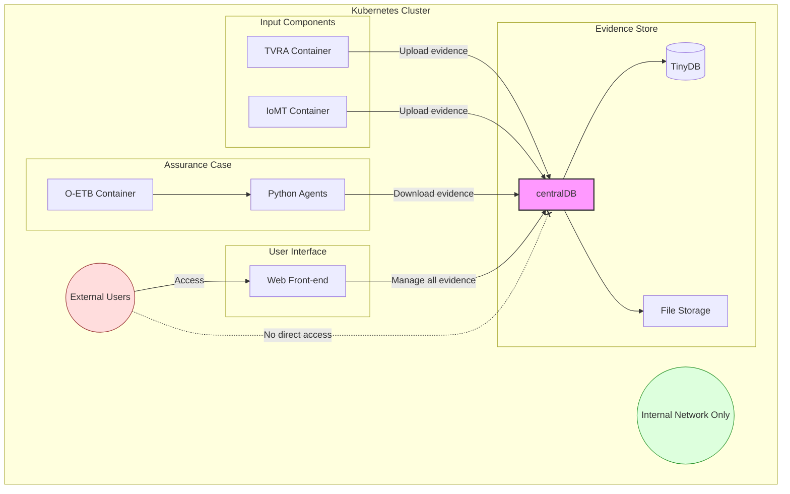
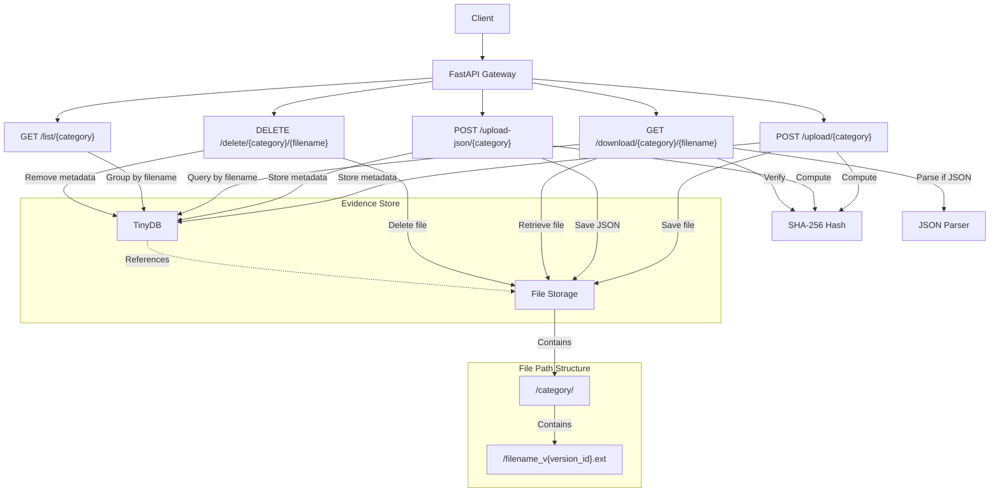

# O-ETB Evidence Management System

This system provides a simple API gateway for storing, retrieving, listing, and deleting evidence, with built-in version control and the ability to attach comments.

## Kubernetes Deployment & Data Flow

The Evidence Management System serves as a central repository for evidence files.



### Key Points:

1. **Input Sources**: Tools, e.g. (TVRA, IoMT) generate evidence and upload it to centralDB.

2. **Central Evidence Store**: centralDB provides a secure repository for all evidence files:
   - Stores files with version control
   - Manages metadata using TinyDB
   - Acts as the single point of truth for evidence

3. **Assurance Case Consumption**: The O-ETB container hosts Python agents that:
   - Retrieve specific evidence needed for assurance cases
   - Pull only what they need when they need it

4. **Network Security**:
   - All communications occur on Kubernetes internal networks
   - No direct external access to centralDB

5. **Administrative Interface**: A Web front-end provides:
   - Complete access to evidence management
   - Upload, download, listing, and deletion capabilities
   - The only user-facing component. Authentication required.

This architecture ensures that evidence flows securely from input sources to assurance cases, with centralDB providing isolation, version control, and a consistent API.

## System Architecture



## Core Features

- **Evidence Storage:** Upload and store files with automatic versioning per filename
- **Metadata Management:** Track original filenames, versions, timestamps, and comments
- **File Integrity:** SHA-256 hash verification for downloaded files
- **JSON Support:** Direct upload and download of JSON data with parsing capabilities
- **Simple API:** RESTful endpoints for all operations
- **Flexible Retrieval:** Download specific versions or the latest version of a file
- **Containerized:** Packaged in a Docker container for easy deployment

## API Endpoints

### Upload Evidence

```
POST /upload/{category}
```

Upload a new evidence file to a specific category.

**Parameters:**
- `category` (path): Category for the evidence (e.g., "tvra", "component-tests")
- `file` (form-data): File to upload
- `comment` (form-data, optional): Comment about the evidence
- `original_filename` (form-data, optional): Original filename to use

**Response:**
```json
{
  "status": "success",
  "filename": "report",
  "version_id": 1,
  "timestamp": "2023-10-27T10:00:00Z",
  "sha256_hash": "e3b0c44298fc1c149afbf4c8996fb92427ae41e4649b934ca495991b7852b855"
}
```

### Upload JSON Evidence

```
POST /upload-json/{category}
```

Upload JSON data directly as evidence without requiring multipart/form-data.

**Parameters:**
- `category` (path): Category for the evidence
- `json_data` (request body): JSON data to upload
- `comment` (query param, optional): Comment about the evidence
- `original_filename` (query param, optional): Original filename (defaults to "data.json")

**Response:**
```json
{
  "status": "success",
  "filename": "threats_data",
  "version_id": 1,
  "timestamp": "2023-10-27T10:00:00Z",
  "sha256_hash": "e3b0c44298fc1c149afbf4c8996fb92427ae41e4649b934ca495991b7852b855"
}
```

### Download Evidence

```
GET /download/{category}/{filename}?version_id={version_id}&as_json={as_json}
```

Download a specific evidence file. If version_id is not provided, the latest version is returned.

**Parameters:**
- `category` (path): Category of the evidence
- `filename` (path): Name of the file
- `version_id` (query, optional): Version ID of the evidence
- `as_json` (query, optional): If true and the file is JSON, returns parsed JSON instead of file

**Response:**
- File content with original filename
- Header `X-SHA256-Hash` with file's SHA-256 hash
- OR JSON response body if `as_json=true` and file is valid JSON

### List Evidence

```
GET /list/{category}
```

List all evidence records within a specific category, grouped by filename.

**Parameters:**
- `category` (path): Category to list evidence for

**Response:**
```json
{
  "report": [
    {
      "version_id": 1,
      "original_filename": "report.pdf",
      "timestamp": "2023-10-27T10:00:00Z",
      "comment": "Initial report",
      "sha256_hash": "e3b0c44298fc1c149afbf4c8996fb92427ae41e4649b934ca495991b7852b855",
      "is_json": false
    },
    {
      "version_id": 2,
      "original_filename": "report.pdf",
      "timestamp": "2023-10-28T15:30:00Z",
      "comment": "Updated report",
      "sha256_hash": "a1e0c64298fc1c149afbf4c8996fb92427ae41e4649b934ca495991b7852b123",
      "is_json": false
    }
  ],
  "threats_data": [
    {
      "version_id": 1,
      "original_filename": "threats_data.json",
      "timestamp": "2023-10-26T09:15:00Z",
      "comment": "Threats analysis",
      "sha256_hash": "b2f0d44298fc1c149afbf4c8996fb92427ae41e4649b934ca495991b7852b789",
      "is_json": true
    }
  ]
}
```

### Delete Evidence

```
DELETE /delete/{category}/{filename}?version_id={version_id}
```

Delete evidence file(s). If version_id is not provided, all versions of the file are deleted.

**Parameters:**
- `category` (path): Category of the evidence
- `filename` (path): Name of the file
- `version_id` (query, optional): Version ID of the evidence to delete

**Response:**
```json
{
  "status": "success"
}
```

## Data Structure

- **Evidence Files:** Stored in `/app/data/files/<category>/` with format `<filename>_v<version_id>.<ext>`
- **JSON Files:** Stored with `.json` extension and can be retrieved as parsed JSON
- **Metadata:** Stored in TinyDB at `/app/data/metadata.json`

Example TinyDB document structure:
```json
{
  "category": "tvra",
  "version_id": 1,
  "filename": "report",
  "original_filename": "report.pdf",
  "timestamp": "2023-10-27T10:00:00Z",
  "comment": "Initial TVRA report",
  "stored_path": "/app/data/files/tvra/report_v1.pdf",
  "sha256_hash": "e3b0c44298fc1c149afbf4c8996fb92427ae41e4649b934ca495991b7852b855"
}
```

Example JSON document structure:
```json
{
  "category": "threats",
  "version_id": 1,
  "filename": "threats_data",
  "original_filename": "threats_data.json",
  "timestamp": "2023-10-28T14:25:30Z",
  "comment": "Threat analysis results",
  "stored_path": "/app/data/files/threats/threats_data_v1.json",
  "sha256_hash": "7c9e6679f5e48b77e77fa4588f2b218e283c7d5724e2ac2e0391e60b542224ab"
}
```

## Deployment

### Docker

Build the Docker image:

```bash
docker build -t evidence-manager .
```

Run the container with volume mapping for persistent data:

```bash
docker run -p 9000:9000 -v ./local_data:/app/data evidence-manager
```

## API Documentation

Access the auto-generated Swagger UI at `/docs` when the service is running.
