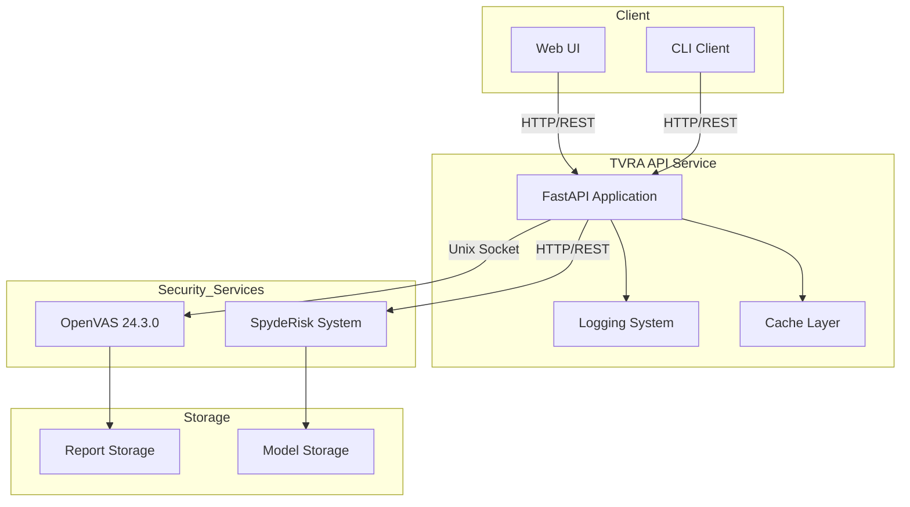
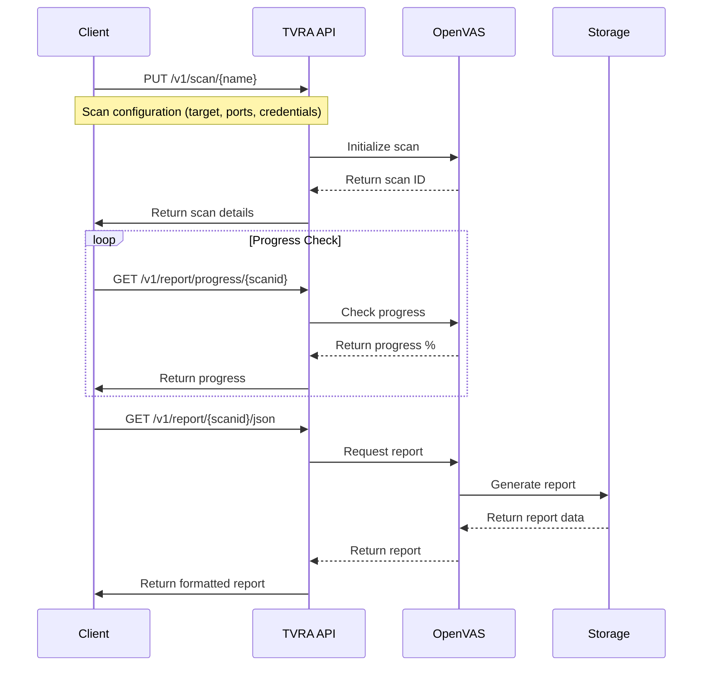
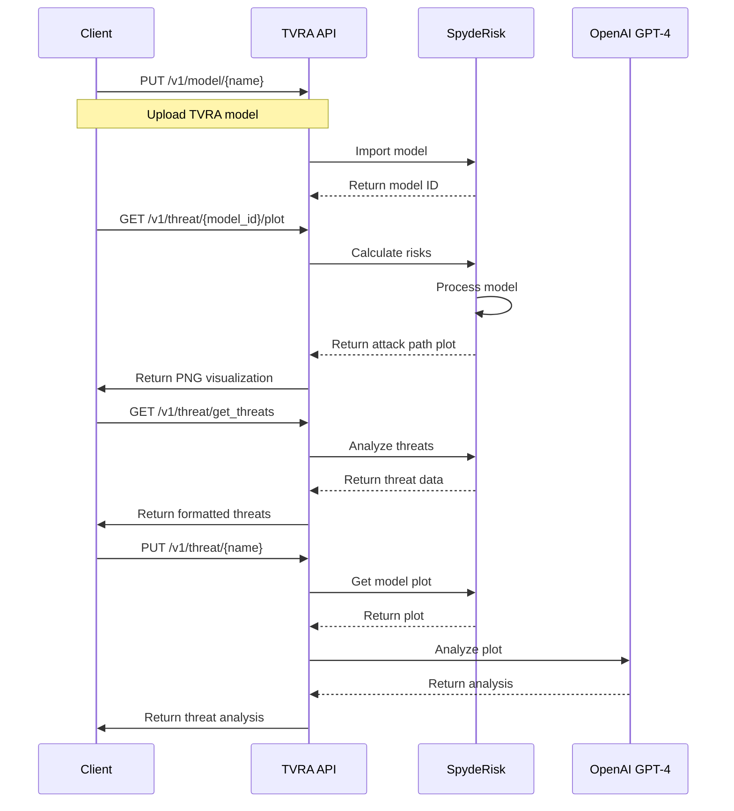
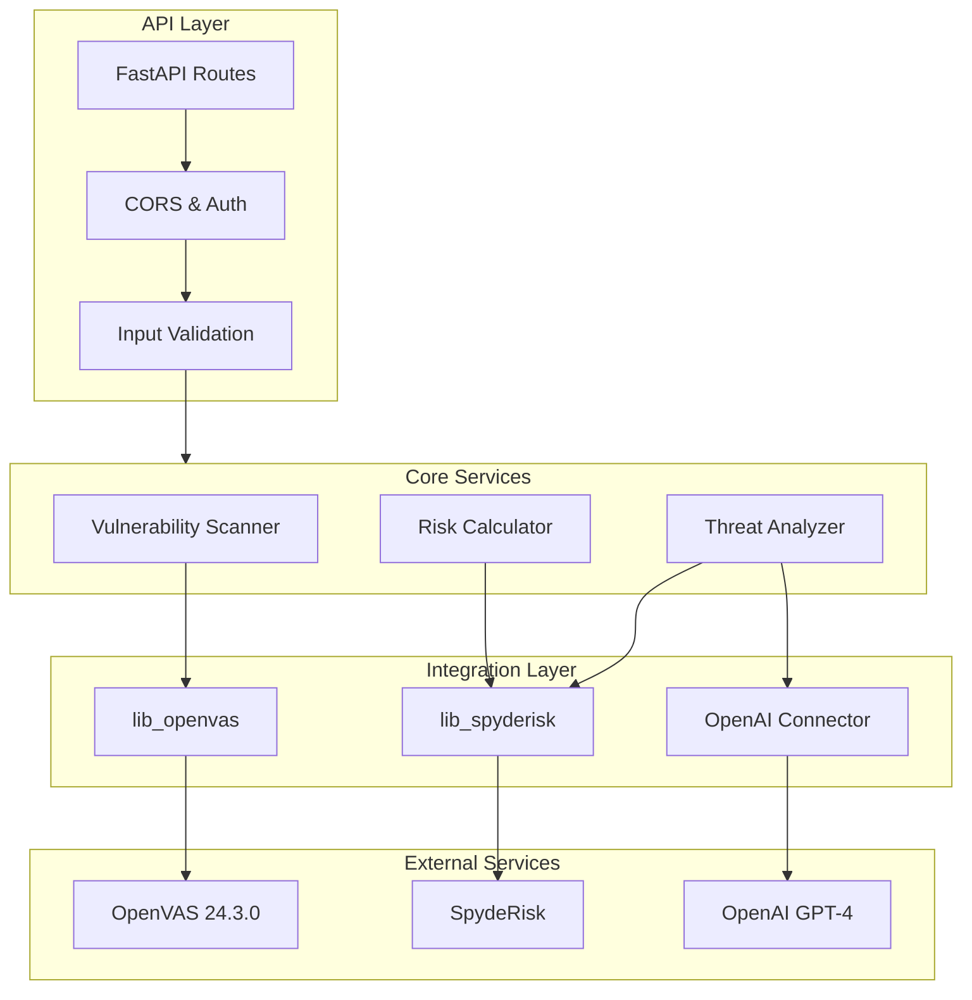
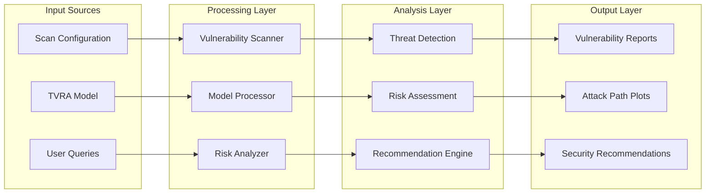
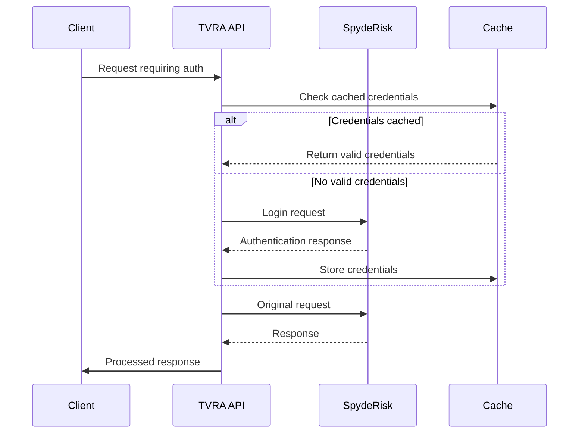
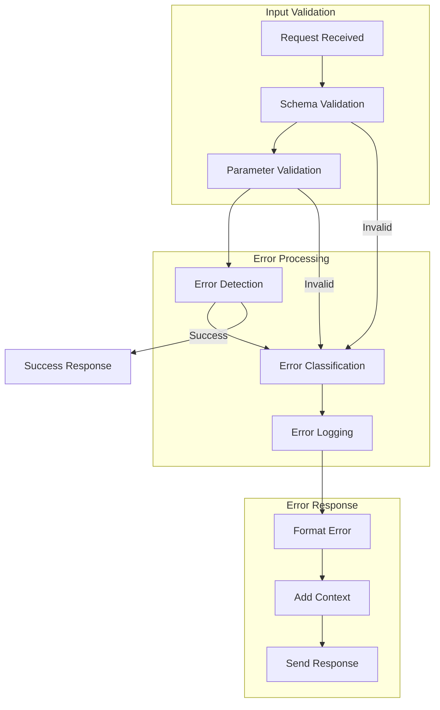
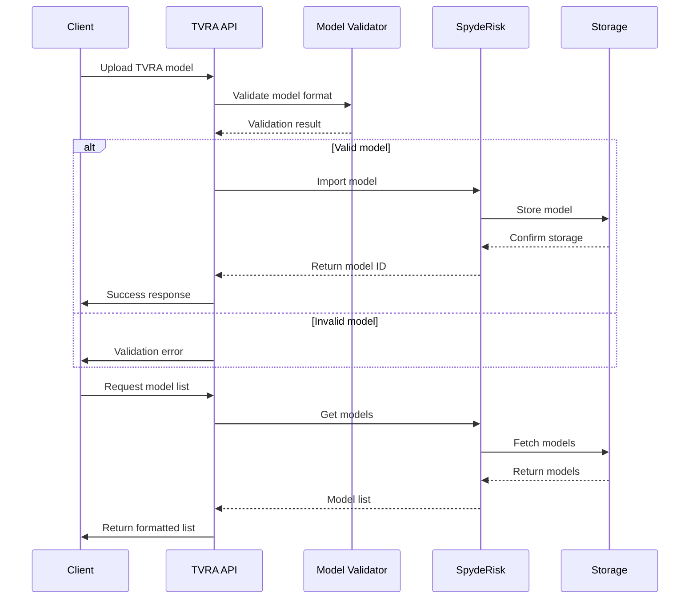

# TVRA System Diagrams

## System Architecture

## Scan Workflow

## Threat Analysis Flow

## Component Architecture

## Data Flow

## Authentication Flow

## Error Handling Flow

## Model Management Flow
