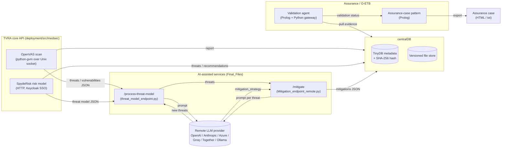

# Architecture

This document describes the components that exist in this repository, how they
communicate, and what each one depends on. It reflects the code as written —
it does not describe a target or idealised architecture.

## Component overview

| Component | Path | Role |
|---|---|---|
| TVRA core API | `deployment/src/medsec` | FastAPI service wrapping OpenVAS vulnerability scanning and SpydeRisk risk modelling |
| Evidence Management System (centralDB) | `centralDB` | FastAPI + TinyDB service; versioned, hashed storage for evidence artefacts |
| AI-assisted threat modelling & mitigation | `Final_Files` | Two FastAPI microservices that call a remote LLM to extend a threat list and draft mitigations |
| Assurance / O-ETB integration | `Assurance/build` | Docker build and example evidence-validation agent for the (external) O-ETB assurance-case engine |
| Sample artefacts | `docs` | Example inputs/outputs produced by the components above, plus the OpenAPI spec and user guide |
| Legacy CLI wrapper | `archive/start_scan.sh` | `docker-compose exec` wrapper for starting a scan; superseded by the `PUT /v1/scan/{name}` endpoint |

Each component is built and deployed as an independent Docker container. None
of them import one another as Python packages — they communicate exclusively
over HTTP, which is why the repository carries four separate
`requirements.txt` files rather than one (see
[REPRODUCIBILITY.md](../REPRODUCIBILITY.md) and
[LIMITATIONS.md](LIMITATIONS.md)).

## Data flow

This diagram is derived from the code paths described below, not from a
separate design document — there is no other source of truth for it in the
repository.

## Components in detail

### 1. TVRA core API (`deployment/src/medsec`)

A FastAPI application (`main.py`) exposing:

- `PUT /v1/scan/{name}` — starts an OpenVAS scan (`api.run_scan` →
  `lib_openvas.py`), connecting to `ospd-openvas` over the Unix socket
  `/run/ospd/ospd-openvas.sock`. Target validation is via
  `lib_openvas.check_valid_target` (IP address or DNS name).
- `GET /v1/report/{scanid}/{json|html}` and `GET /v1/report/progress/{scanid}`
  — scan status/report retrieval.
- `PUT /v1/model/{name}` — imports a TVRA JSON model export into SpydeRisk
  (`tvra_parser.py` / `tvra_asset.py` parse the model; `lib_spyderisk.py`
  creates the corresponding assets/relations/misbehaviours/controls via the
  SpydeRisk REST API).
- `GET /v1/threat/get_threats`, `GET /v1/threat/get_recommendations`,
  `GET /v1/threat/{model_id}/plot`, `PUT /v1/threat/{name}` — risk
  calculation, threat listing, attack-path plotting, and an
  image-based "Threat Modelling Companion" call that sends the generated
  attack-path plot to the OpenAI vision API directly (this one path is
  hardcoded to OpenAI, unlike the provider-agnostic `Final_Files` services).
- `GET /v1/model/find/{name}`, `GET /v1/model/list`.

It authenticates to SpydeRisk via Keycloak SSO (`lib_spyderisk.login_to_spyderisk`)
using credentials that are hardcoded in the source
(`deployment/src/medsec/lib_spyderisk.py`, `main.py`'s call sites), against a
fixed URL (`http://host.docker.internal:8089`). TLS verification is disabled
for all of these calls (`SESS.verify = False`). See
[THREAT_MODEL.md](THREAT_MODEL.md) for the implications.

The Docker image (`deployment/Dockerfile`) builds `gvm-libs`,
`openvas-scanner` and `ospd-openvas` from source on top of Ubuntu 22.04; the
scanner and API run inside the same container and communicate over the Unix
socket, so this dependency is not network-exposed.

### 2. Evidence Management System / centralDB (`centralDB`)

A FastAPI application (`app/main.py`) backed by TinyDB (`app/storage.py`) that
stores files and JSON payloads under `/app/data/files/<category>/`, with
metadata (category, filename, version, timestamp, comment, SHA-256 hash) in
`/app/data/metadata.json`. Every filename is passed through
`secure_filename()` (regex-based sanitisation) before being used in a path.
Uploads are versioned per `(category, filename)` pair; downloads verify the
stored SHA-256 hash before returning the file. This is the "single point of
truth" evidence store referenced by the other services' READMEs — the TVRA
core API, the AI-assisted services, and the O-ETB example agent all write to
or read from it, but none of them import its code; they all use its HTTP API.

### 3. AI-assisted threat modelling & mitigation (`Final_Files`)

Two independent FastAPI services:

- `threat_model_endpoint.py` (`POST /process-threat-model`) — given a threat
  model JSON and a list of already-detected threats, asks a remote LLM to
  identify threats *not* already present, referencing ISO/OWASP/NIST
  (`prompts.py: threat_json_prompts`).
- `Mitigation_endpoint_remote.py` (`POST /mitigate`) — given a list of
  threats, calls the LLM once per threat to produce a `mitigation_strategy`
  field, writing results incrementally to `mitigation_outputs/<timestamp>.json`
  after every threat (`write_json`, atomic rename).

Both call through `remote_ai_client.py` (`RemoteAIClient` /
`call_remote_model`), which normalises requests across OpenAI, Anthropic,
Azure OpenAI and Ollama-compatible chat/completion APIs. Provider selection,
model name, and the API key itself are all supplied **per request** in the
JSON body (`config.py: ModelConfig`, `create_model_config`) rather than being
held server-side — this is a deliberate design choice documented in
`Final_Files/CONFIGURATION.md` for containerised/Kubernetes deployment, and
it is discussed as a trust-boundary concern in
[THREAT_MODEL.md](THREAT_MODEL.md). Matching CLI clients
(`threat_model_client.py`, `Mitigation_client.py`) POST to these endpoints
from a JSON file on disk.

`config.py` rejects `base_url` values that are literally `localhost` or
`127.0.0.1` ("no localhost allowed" — a deployment-reachability constraint
for containers, not a security control); see
[THREAT_MODEL.md](THREAT_MODEL.md) for why this does not amount to SSRF
protection.

### 4. Assurance / O-ETB integration (`Assurance/build`)

`Assurance/build/Dockerfile` builds an image containing SWI-Prolog and a
FastAPI shim on top of an **externally supplied** `Assurance/` directory
(`COPY Assurance /Assurance`) — the O-ETB engine itself (the `src/`, `BUILD/`
Prolog sources) is not part of this repository; per
`Assurance/build/BUILD_GUIDE.md` it comes from a private upstream repository
(`MedSecurance/Assurance`). What *is* in this repository, under
`Assurance/build/files/KB/`, is the user-contributed Knowledge Base content
for a minimal example:

- `PATTERNS/pattern_simple.pl` — an assurance-case pattern
  (`simple_threat_analysis`) claiming "System {SystemName} is secure",
  supported by one piece of evidence (`simple_threat`).
- `EVIDENCE/categories.pl` — declares the `simple_threat` evidence category
  and binds it to the `simple_agent` validation agent.
- `AGENTS/simple_agent.pl` — the Prolog validation predicate
  (`simple_threat_validate/5`), which shells out to `simple_gateway.py` and
  reads its result from `simple_result.txt`.
- `AGENTS/simple_gateway.py` — a Python script that exercises the centralDB
  HTTP API (upload, list, download by version, delete) as an end-to-end
  check, then writes the downloaded content to `simple_result.txt` so the
  Prolog agent can report a validation status back into the assurance case.

This is the traceability/audit layer described in
[AI_ASSURANCE.md](AI_ASSURANCE.md): an assurance-case claim is only marked
`valid` once its declared evidence exists in centralDB and passes the
category's validation agent.

### 5. Sample artefacts (`docs/`)

Static example inputs/outputs produced by the components above (a TVRA model
input, scan/threat/recommendation JSON, an attack-path SVG, an HTML
vulnerability report), the OpenAPI schema for the TVRA core API, a Mermaid
diagrams document, and the end-user guide. These are committed outputs, not
source code — see [LIMITATIONS.md](LIMITATIONS.md) for their size and
provenance.

## Persistence

| Store | Location | Contents |
|---|---|---|
| TinyDB | `centralDB`: `/app/data/metadata.json` | Evidence metadata (category, filename, version, timestamp, comment, SHA-256) |
| Flat files | `centralDB`: `/app/data/files/<category>/` | The evidence files/JSON themselves |
| Flat files | `Final_Files`: `mitigation_outputs/*.json` | Per-run mitigation results |
| External | SpydeRisk (Jena TDB, per `deployment/docker-compose.yml`) | Risk models, assets, controls |
| External | O-ETB `REPOSITORY/` (not in this repo) | Assurance cases and evidence status |

## Trust boundaries

See [THREAT_MODEL.md](THREAT_MODEL.md) for a full treatment. In summary:

- Every FastAPI service in this repository (TVRA core API, centralDB,
  `Final_Files` AI endpoints, the O-ETB API shim) is unauthenticated as
  written — access control is left to network placement.
- The TVRA core API's CORS policy allows any origin with credentials
  (`deployment/src/medsec/main.py`).
- LLM provider API keys cross the network boundary in each request body
  rather than being held server-side.
- SpydeRisk and OpenVAS access are treated as inside the same trust zone as
  the TVRA core API (hardcoded dev credentials, disabled TLS verification,
  a local Unix socket).
