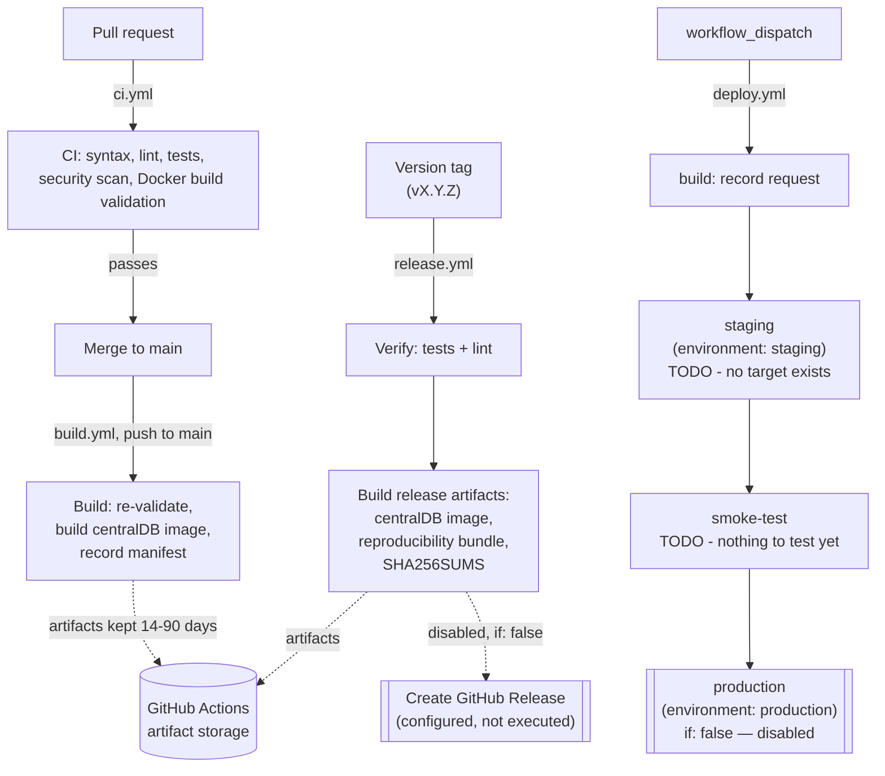

# CI/CD Pipeline

This document describes the automated pipeline in `.github/workflows/` end
to end: what runs today, what is wired up but deliberately inactive, and
what remains future work. It complements
[docs/ARCHITECTURE.md](ARCHITECTURE.md) (what the system is),
[docs/THREAT_MODEL.md](THREAT_MODEL.md) (why production deployment is
gated), and [REPRODUCIBILITY.md](../REPRODUCIBILITY.md) (why only one of
the three Dockerfiles builds standalone from this repository).

## Pipeline overview



Legend: solid boxes run today; the double-bordered boxes
(`Create GitHub Release`, `production`) are fully configured but disabled
(`if: false`) — see [What remains intentionally disabled](#what-remains-intentionally-disabled).

## CI (`.github/workflows/ci.yml`) — implemented

Triggers: `pull_request` targeting `main`, `push` to `main`.

| Job | What it does | Blocking? |
|---|---|---|
| `test` | Installs `requirements-dev.txt` + `deployment/src/requirements.txt`, runs `python -m compileall` (syntax check across all services), then `pytest tests/ -v` (34 tests) | Yes |
| `lint` | `ruff check --select E9,F63,F7,F82` (syntax errors, undefined names only — not a full style lint, see [CONTRIBUTING.md](../CONTRIBUTING.md)) | Yes |
| `security-scan` | `pip-audit` against all 5 `requirements.txt` files; `bandit` static scan of application code | No (`continue-on-error: true` — see [Why security-scan stays informational](#why-security-scan-stays-informational)) |
| `docker-build-validation` | Matrix: full `docker build` (no push) for `centralDB`; Dockerfile lint-only check (`docker buildx build --check`) for `Assurance/build` and `deployment` — see [Docker build validation scope](#docker-build-validation-scope) | Yes for the build step; the check-only steps fail on genuine Dockerfile syntax problems, not on missing build context |

Workflow-level `permissions: contents: read` (no job needs more).
`concurrency` cancels superseded runs on the same ref — safe here because
nothing in this workflow touches real infrastructure.

### Docker build validation scope

Only **`centralDB/Dockerfile`** builds standalone from this repository's
tracked files:

| Dockerfile | Full build in CI? | Why |
|---|---|---|
| `centralDB/Dockerfile` | **Yes** | Self-contained: `python:3.9-slim` base, its own `requirements.txt`, `COPY . .` — no external inputs |
| `Assurance/build/Dockerfile` | No — lint/check only | `COPY Assurance /Assurance` expects an externally-supplied O-ETB engine source tree that is not part of this repository (see [docs/ARCHITECTURE.md](ARCHITECTURE.md) and [REPRODUCIBILITY.md](../REPRODUCIBILITY.md)) |
| `deployment/Dockerfile` | No — lint/check only | Expects `deployment/nvt/{plugins,products,advisories}` (the OpenVAS vulnerability feed), which is deliberately `.gitignore`d — large and updated independently of source. It also is **not the image `deployment/docker-compose.yml` actually runs**: the `ospd_openvas` service in that compose file pulls the third-party image `mirek186/ospd_openvas:latest` instead (see [Supply-chain observations](#supply-chain-observations)) |

Attempting a full build of the latter two would either always fail for
structural reasons unrelated to code quality (never a meaningful pass/fail
signal) or take excessive time compiling C libraries from source on every
PR. The lint-only check (`docker buildx build --check`) still catches real
Dockerfile defects (bad instruction syntax, deprecated forms, etc.) without
needing the missing build context.

### Why security-scan stays informational

`pip-audit` currently reports real, pre-existing known vulnerabilities in
pinned dependencies (22 in `centralDB/requirements.txt`, 14 in
`deployment/src/requirements.txt` — see
[docs/LIMITATIONS.md](LIMITATIONS.md)). Making this job blocking today
would make CI permanently red for reasons unrelated to any given change.
It stays informational (visible on every run, `continue-on-error: true`)
until those pins are deliberately reviewed and bumped — see
[Supply-chain observations](#supply-chain-observations).

## Main branch build (`.github/workflows/build.yml`) — implemented

Triggers: `push` to `main`, `workflow_dispatch`.

1. **`validate`** — re-runs compileall/pytest/ruff independently of `ci.yml`
   (defensive: this workflow can be dispatched manually on any ref, so it
   doesn't assume `ci.yml` already validated this exact commit).
2. **`build-images`** — builds the `centralDB` image (`docker/build-push-action`,
   `push: false`), saves it to a `.tar` via `outputs: type=docker`, uploads
   it as a GitHub Actions artifact (14-day retention). No registry push —
   no registry credentials exist in this repository.
3. **`record-manifest`** — writes a JSON manifest (git SHA, run ID, images
   built vs. lint-checked-only and why) and uploads it as a 90-day artifact.

Nothing here deploys, pushes to a registry, or touches an environment.

## Release (`.github/workflows/release.yml`) — partially implemented

Triggers: tags matching `v[0-9]+.[0-9]+.[0-9]+`, or `workflow_dispatch`.

1. **`verify`** — re-runs the full quality gate (compileall, pytest, ruff)
   at the exact tagged commit.
2. **`build-release-artifacts`** — builds the `centralDB` image, packages a
   reproducibility bundle (`README.md`, `REPRODUCIBILITY.md`, `LICENSE`,
   `CITATION.cff`, `SECURITY.md`, all of `docs/*.md`, and every
   `requirements.txt` in the repository) as a `.tar.gz`, generates
   `SHA256SUMS.txt` for everything produced, uploads all of it as a
   90-day GitHub Actions artifact.
3. **`create-github-release`** — **disabled** (`if: false`). Fully
   configured (`permissions: contents: write`, scoped to this job only;
   downloads the artifacts from step 2; `gh release create` with
   `--generate-notes`) but does not run. See
   [What remains intentionally disabled](#what-remains-intentionally-disabled).

No tags exist in this repository yet (`git tag -l` is empty), so this
workflow has never run.

## Deploy (`.github/workflows/deploy.yml`) — skeleton only, inactive

Trigger: `workflow_dispatch` only. Models
`build → staging → smoke-test → production`, using GitHub Environments
named `staging` and `production`. **No job in this workflow performs a real
deployment.** See
[What remains intentionally disabled](#what-remains-intentionally-disabled)
for exactly what's missing and why.

## GitHub Environments — you must configure these manually

This session did **not** and **will not** create or modify GitHub
Environments, secrets, or branch protection — that's outside what a local
file change can do, and outside what was authorized. `deploy.yml` (and
`release.yml`'s disabled release job) reference two environments by name:

- `staging`
- `production`

To make the `production` gate in `deploy.yml` meaningful once a real
deployment target exists, configure in **Settings → Environments** on
GitHub:

- **Required reviewers** on `production` (this is what actually pauses the
  `production` job for manual approval — there is no separate "approval"
  job in the workflow; GitHub enforces it via the environment's protection
  rule once you configure it).
- **Deployment branch restriction** on `production` (e.g. only `main`, or
  only tags matching `v*`).
- **Environment-specific secrets** on both `staging` and `production` (see
  below) — never store real credentials in workflow YAML.

## Required GitHub Environment secrets (names only — not created)

No secret values were created or examined beyond what's already documented
as intentionally public examples (`deployment/.env.example`). These are the
categories a real deployment would eventually need, derived from what the
application actually reads (`Final_Files/config.py`, `deployment/.env.example`,
`deployment/docker-compose.yml`):

```text
Required GitHub Environment Secrets

# Container registry (only if/when image push is enabled — not configured today)
REGISTRY_URL
REGISTRY_USERNAME
REGISTRY_PASSWORD

# Keycloak / SpydeRisk stack (see deployment/.env.example — dev-only
# defaults exist there; production must not reuse them)
STAGING_KEYCLOAK_ADMIN_USERNAME
STAGING_KEYCLOAK_ADMIN_PASSWORD
STAGING_KEYCLOAK_CREDENTIALS_SECRET
PRODUCTION_KEYCLOAK_ADMIN_USERNAME
PRODUCTION_KEYCLOAK_ADMIN_PASSWORD
PRODUCTION_KEYCLOAK_CREDENTIALS_SECRET

# Remote LLM provider credentials for Final_Files (currently caller-supplied
# per request at runtime — see docs/THREAT_MODEL.md; a hardened deployment
# would instead hold these server-side as environment secrets)
STAGING_LLM_API_KEY
PRODUCTION_LLM_API_KEY

# Deployment target access (host/cluster/cloud credentials) — NOT
# documented anywhere in this repository yet; do not invent these. See
# "What remains intentionally disabled" below.
STAGING_DEPLOY_TARGET_CREDENTIAL   # placeholder name only
PRODUCTION_DEPLOY_TARGET_CREDENTIAL  # placeholder name only
```

The last two are placeholders because **no real deployment target is
documented anywhere in this repository** (no server address, cloud account,
or Kubernetes cluster) — filling them in requires a decision this document
cannot make on your behalf.

## Concurrency strategy

| Workflow | Group | `cancel-in-progress` | Why |
|---|---|---|---|
| `ci.yml` | `ci-<workflow>-<ref>` | `true` | Never touches real infrastructure; superseded PR runs are pure waste |
| `build.yml` | `build-<ref>` | `true` | Same — build/package only, safe to cancel |
| `release.yml` | `release-<ref>` | `false` | A release build shouldn't be silently torn down mid-run once triggered |
| `deploy.yml` (`production` job) | `production-deployment` | `false` | An interrupted production deployment is worse than a queued one — per your explicit instruction, this must never auto-cancel an in-flight run |

## Supply-chain observations

- **Actions are pinned to major version tags** (`actions/checkout@v4`,
  `actions/setup-python@v5`, `docker/setup-buildx-action@v3`,
  `docker/build-push-action@v6`, `actions/upload-artifact@v4`,
  `actions/download-artifact@v4`) — consistent with what `ci.yml` already
  did before this change. Full SHA-pinning would be stronger still but was
  not introduced here, to stay consistent with the existing convention
  rather than mixing styles.
- **`pip-audit`** (dependency CVEs) and **`bandit`** (static code security
  scan) already run in `ci.yml`, informational for now — see
  [Why security-scan stays informational](#why-security-scan-stays-informational).
- **`SHA256SUMS.txt`** is generated for every release artifact
  (`release.yml`).
- **SBOM generation was not added.** `docker/build-push-action` supports
  `sbom: true` (via BuildKit's attestation feature) cleanly, and would be a
  reasonable follow-up for the `centralDB` image specifically — not added
  now to avoid tooling added "for a badge" per your instructions, since
  nothing currently consumes an SBOM.
- **Newly discovered, not fixed:** `deployment/docker-compose.yml`'s
  `ospd_openvas` service pulls `mirek186/ospd_openvas:latest` — a
  third-party, unofficial Docker Hub image, unpinned to a digest or even a
  version tag (`:latest`). This is a real supply-chain gap (arbitrary image
  content can change under that tag with no notice) but is **out of scope
  for this CI/CD change** — it's an existing deployment configuration
  choice, not something introduced or fixed here. Recorded for awareness;
  a future change should pin it to a digest (`@sha256:...`) or replace it
  with the image `deployment/Dockerfile` actually builds, once that build
  path is made reproducible (see [REPRODUCIBILITY.md](../REPRODUCIBILITY.md)).

## Deployment security gate

Per [docs/THREAT_MODEL.md](THREAT_MODEL.md), this repository currently has,
as written:

- No authentication on any of its four FastAPI services.
- A CORS wildcard (`allow_origins=["*"]` with `allow_credentials=True`) on
  the TVRA core API.
- Hardcoded SpydeRisk/Keycloak development credentials
  (`testadmin`/`password`) in `deployment/src/medsec/lib_spyderisk.py`.
- TLS certificate verification disabled for all SpydeRisk HTTP calls
  (`SESS.verify = False`).
- The `mirek186/ospd_openvas:latest` unpinned third-party image noted above.

**None of this was fixed as part of this CI/CD change** — per your explicit
instruction, this task does not silently fix architectural security issues.
It is the reason `deploy.yml`'s `production` job stays `if: false` and why
`create-github-release` stays disabled: shipping a build or a public
release of a system with these gaps could reasonably be read as an implicit
"this is ready to expose," which it is not.

**Research/development deployment ≠ production-hardened deployment.**
Nothing in this pipeline, once enabled, should be read as evidence that the
gaps above have been addressed. `SECURITY.md` already states this system is
intended for local development or an isolated lab network; that guidance
stands independently of anything in this document.

## Currently implemented / configured-but-inactive / future work

| Item | Status |
|---|---|
| `ci.yml`: test, lint, security-scan, docker-build-validation | **Implemented** — runs on every PR and push to `main` |
| `build.yml`: validate, build centralDB image, record manifest | **Implemented** — runs on push to `main` and `workflow_dispatch` |
| `release.yml`: verify, build release artifacts, checksums | **Implemented** — runs on version tags and `workflow_dispatch` |
| `release.yml`: `create-github-release` | **Configured but inactive** (`if: false`) |
| `deploy.yml`: `build`, `staging`, `smoke-test` jobs | **Configured but inactive** — steps are `TODO` placeholders; no real target exists |
| `deploy.yml`: `production` job | **Configured but inactive** (`if: false`) |
| GitHub Environments (`staging`, `production`) | **Not created** — must be configured manually in GitHub Settings |
| GitHub Environment secrets | **Not created** — see the categories listed above |
| Container registry push | **Future work** — no registry configured or credentialed |
| Real staging/production deployment mechanism | **Future work** — no target documented anywhere in this repository; must be decided and documented before `deploy.yml` can do anything real |
| SBOM generation | **Future work** — noted above, not added |
| Full SHA-pinning of GitHub Actions (vs. major-version pinning) | **Future work** |
| Fixing the security gaps listed above | **Out of scope for this task** — tracked in [docs/THREAT_MODEL.md](THREAT_MODEL.md) |
